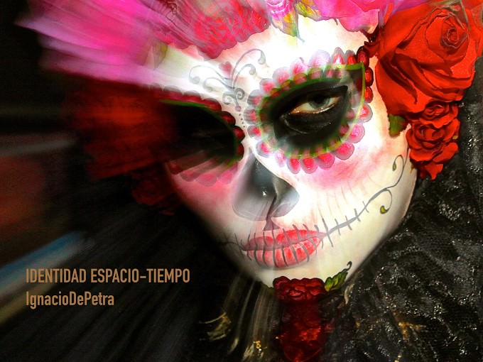
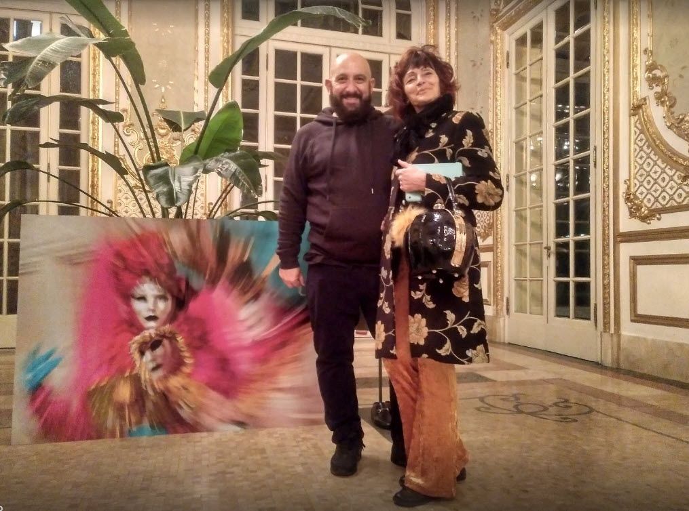

# Ignacio De Petra - Identidad Espacio Tiempo

The secret of each photographer depends on the ability to see, influence, modify, check to create light

After a whirlwind romance with a Kodak decides formed with the great photographer Cristina Garcia Rodero, who spent four years at the School of Applied Arts in Madrid, specializing in photography. Later, once their education is complete, share experiences, work and exhibitions: Exponoviembre, Packaging, the Cervantes Institute in Madrid (UNIVERSE IN EAPAÑOL) d exposure Linde Palais de Arte Fiera Bologna, 2015 Casa de Vacas, Madrid .. Collaborations your photos Atos Lombardini whit whit ... A present in the latest editions of the best state fairs photographic books: Milan, New York or Paris. Ignacio has worked with important artists whose generosity will always be grateful: Cristina Garcia Rodero, Pedro Garhel, Oscar Benedi

The IgnaciodePetra photographic work can be found and purchased at several sites: Linde Le Palais, Dürer Studies, 

After a period of experimentation develops its own creative perception, where the most orthodox photograph gives way to a new kind of work, combining technique and sensitivity by the author. IgnaciodePetra deconstructs photography through a refined technique and never artistica.Sus photographs are digitally manipulated. It is an intimate moment between time and light.

[WebGL Museum](https://estebanrfp.github.io/ignaciodepetra/)

## Works
- Identidad Espacio Tiempo

## ScreenShoot

-------------

#### Credits & Thanks
* [IgnacioDePetra](https://estebanrfp.github.io/ignaciodepetra/)

* [by estebanrfp](https://desarrolloactivo.com/)
